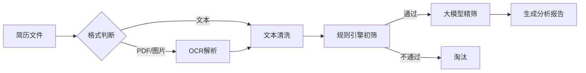

---

### **告别“海选”！用最简单的方案，快速搭建AI简历筛选系统**

**作者：雷哥 | 来源：雷哥@九天揽月**

---

#### **一、背景：HR的“简历噩梦”**

你是否也经历过这样的场景？
* 发布一个热门岗位，一天之内收到**300+份**简历。
* 打开邮箱，密密麻麻的简历标题让人眼花缭乱。
* 你只能一遍遍地Ctrl+F，查找“3年经验”、“Python”、“本科”这些关键词。
* 一天下来，眼睛酸痛，效率低下，还生怕漏掉那个“对的人”。

这，就是传统招聘的“海选”困局。我们急需一个AI助手，但市面上的方案要么太贵，要么太复杂，动辄需要组建一个AI团队。

今天，我就分享一个**简单、快速、成本极低**的AI简历筛选方案。它不追求技术上的“高大上”，只追求**快速落地，解决实际问题**。

---

#### **二、要解决的核心问题**

我们不求一步到位，先解决最痛的三个问题：
1. **效率低**：手动筛选几百份简历，耗时耗力。
2. **易出错**：疲劳状态下，容易看漏关键信息。
3. **不专业**：仅靠关键词匹配，无法评估候选人的综合潜力。

我们的目标是：**让AI先做“初筛”，把明显不符合要求的简历过滤掉，只把最有可能匹配的简历交给HR做最终决策。**

---

#### **三、我们的“极简”技术方案：规则 + 大模型**

我们不搞复杂的机器学习模型，不搞庞大的数据标注。我们的方案只有两个核心组件：

1. **规则引擎 (Rule Engine)**：一个“冷酷无情”的守门员。
2. **大模型 (LLM)**：一个“火眼金睛”的面试官。

**核心思想**：**先用规则引擎做“快筛”，再用大模型对“精华”做“精筛”**。这样，大模型的调用次数被控制在15%以内，成本极低。

---

#### **四、系统工作流程（简单到画张图就懂）**



**流程说明**：
1. **输入**：支持PDF、图片、Word等常见格式。
2. **解析**：如果是PDF或图片，先用OCR（如阿里云OCR）转成文字；如果是文本，直接清洗格式。
3. **初筛**：**规则引擎**上场！它会检查：
* “学历是本科以上吗？”
* “工作年限超过3年吗？”
* “简历里有‘Python’或‘Java’吗？”
* 如果这些“硬性条件”不满足，**直接淘汰**。这一步能过滤掉80%以上的简历。
4. **精筛**：只有通过初筛的Top 20%简历，才会交给**大模型**进行深度分析。
5. **输出**：大模型会生成一份**结构化报告**，清晰地列出候选人的“匹配点”和“差距”。

---

#### **五、关键技术实现（简单、可行、快速）**

**1. 规则引擎层：用代码写“招聘要求”**

这不需要复杂的系统，一个简单的Python脚本就能搞定。

```python
# 伪代码示例
def rule_filter(resume_text, job_jd):
# 硬性条件
if not has_degree(resume_text, "本科"):
return False, "学历不符合"
if not has_experience(resume_text, 3):
return False, "年限不足"

# 关键词匹配（加权）
score = 0
if "Python" in resume_text: score += 1.0
if "Django" in resume_text: score += 0.8
if "MySQL" in resume_text: score += 0.5

if score < 1.5: # 阈值
return False, "技能匹配度低"

return True, "通过初筛"
```

**2. 大模型分析层：用“提示词”当HR**

我们不需要微调模型，只需要设计一个强大的**提示词（Prompt）**。

```text
你是一个专业HR助手，请对比分析以下简历与岗位要求：

【简历摘要】
{简历的纯文本内容}

【岗位JD】
{岗位描述的纯文本内容}

请按以下要求输出：
1. 匹配点：列出3-5项核心优势
2. 差距：指出3项关键不足
3. 建议：面试考察重点

输出JSON格式：
{
"match": ["匹配项1", "匹配项2"],
"gap": ["缺失技能", "经验不足"],
"suggestion": "建议考察..."
}
```

**技术选型建议**：
* **OCR服务**：阿里云OCR、百度OCR，按量付费，几毛钱一次，成本极低。
* **大模型API**：通义千问、DeepSeek、文心一言等，按Token计费。因为我们只对少量简历调用，**每月成本可能不到100元**。

---

#### **六、为什么这个方案“简单”却“有效”？**

* **开发快**：核心逻辑清晰，一个周末就能搭出原型。
* **成本低**：没有昂贵的算力和人力投入，按需付费。
* **可解释**：规则是透明的，大模型的报告是清晰的，HR能看懂，能信任。
* **易迭代**：HR觉得哪里不准，改改规则或提示词就行，无需重新训练模型。

---

#### **七、总结：用AI，先解决80%的“脏活累活”**

我们不需要一个完美的AI，我们只需要一个能**快速、低成本**帮我们解决80%重复性工作的工具。

这个“规则+大模型”的极简方案，就是这样一个工具。它不炫技，但**务实、高效、可行**。

**技术的本质，是解决问题，而不是制造问题。**

如果你也想用最简单的方式，让AI为你的招聘赋能，欢迎加入我的知识星球“雷哥@九天揽月”。在这里，我将持续分享更多AI技术在企业中**低成本、高效率**落地的实战案例。